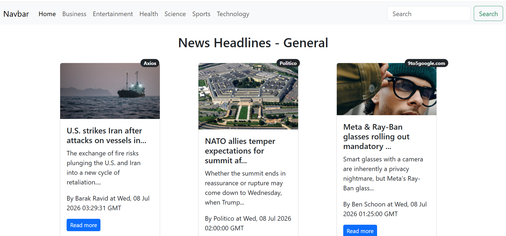
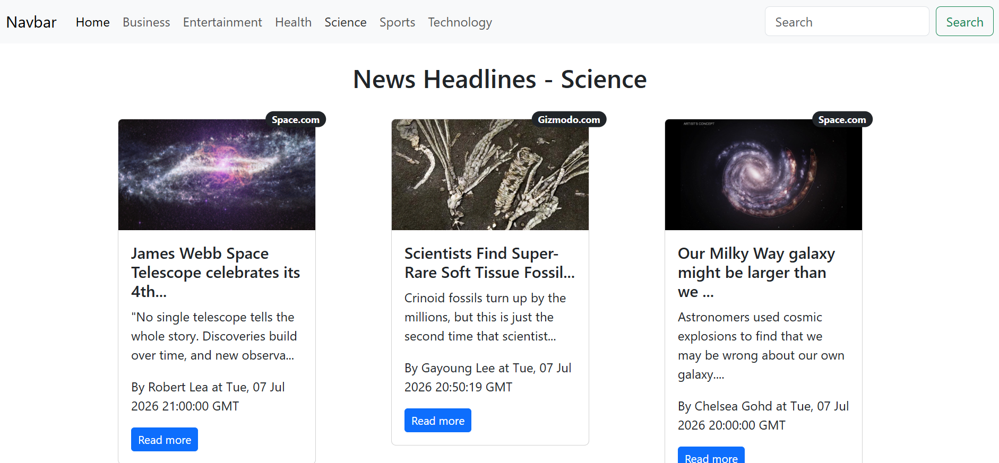

# 📰 NewsApp

A modern, responsive news application built with **React.js** that delivers the latest headlines using the **NewsAPI**. The application provides category-wise news browsing with an infinite scrolling experience for smooth and uninterrupted reading.

---

## 🚀 Features

* 📰 View the latest top headlines
* 📂 Browse news by category

  * General
  * Business
  * Entertainment
  * Health
  * Science
  * Sports
  * Technology
* ♾️ Infinite scrolling for seamless article loading
* ⚡ Fast client-side navigation with React Router
* 📱 Fully responsive UI built with Bootstrap 5
* 🖼️ Default image for articles without thumbnails
* 👤 Displays article author, source, and publication date
* 🔄 Loading spinner while fetching data
* 🔐 Secure API key management using environment variables

---

## 🛠️ Tech Stack

* React.js
* React Router DOM
* Bootstrap 5
* NewsAPI
* React Infinite Scroll Component
* JavaScript (ES6+)
* HTML5
* CSS3

---

## 📁 Project Structure

```text
src/
│
├── components/
│   ├── Loader.js
│   ├── Loadinggif.js
│   ├── Navbar.js
│   ├── News.js
│   └── NewsItem.js
│
├── App.js
├── App.css
└── index.js
├── ...

```

---

## ⚙️ Getting Started

### 1. Clone the repository

```bash
git clone https://github.com/Taahaomer/Newsapp.git
```

> Replace **NewsApp** with your repository name if it's different.

### 2. Navigate to the project directory

```bash
cd Newsapp
```

### 3. Install dependencies

```bash
npm install
```

### 4. Configure Environment Variables

Create a `.env` file in the project root and add your NewsAPI key:

```env
REACT_APP_NEWS_API=YOUR_NEWSAPI_KEY
```

> Your API key is loaded securely using environment variables and is **not committed** to GitHub.

### 5. Start the application

```bash
npm start
```

The application will be available at:

```text
http://localhost:3000
```

---

## 📰 Available Categories

| Category      | Route            |
| ------------- | ---------------- |
| Home          | `/home`          |
| Business      | `/business`      |
| Entertainment | `/entertainment` |
| Health        | `/health`        |
| Science       | `/science`       |
| Sports        | `/sports`        |
| Technology    | `/technology`    |

---

## 📸 Screenshots

Add screenshots of your application here.

Example:

```text
screenshots/
├── home.png
├── science.png
```

```markdown



```

---

## 🔄 Application Workflow

1. Fetches the latest headlines from NewsAPI.
2. React Router handles navigation between news categories.
3. Each category triggers a new API request.
4. Infinite scrolling automatically loads more articles.
5. News cards display:

   * Article Image
   * Headline
   * Short Description
   * Author
   * News Source
   * Publication Date
   * Link to the full article

---

## 📦 Dependencies

* React
* React Router DOM
* Bootstrap 5
* React Infinite Scroll Component
* PropTypes

---

## 🎯 Future Improvements

* 🔍 Functional search feature
* 🌍 Support for multiple countries
* 🌙 Dark mode
* ❤️ Bookmark favorite articles
* 📑 Optional pagination
* 📊 Trending news section
* 🧠 AI-powered article summaries
* 🔔 Breaking news notifications

---

## 📚 What I Learned

This project strengthened my understanding of:

* React Functional Components
* React Hooks (`useState`, `useEffect`)
* React Router DOM
* REST API Integration
* Environment Variables
* Infinite Scrolling
* State Management
* Component-Based Architecture
* Bootstrap Responsive Design
* Asynchronous JavaScript using the Fetch API

---

## 👨‍💻 Author

**Taaha Omer**

Bachelor's Student in Computer Science

**GitHub:** https://github.com/Taahaomer

**LinkedIn:** https://www.linkedin.com/in/taaha-omer-71265921b/

---

## 🤝 Contributing

Contributions, suggestions, and improvements are welcome. Feel free to fork the repository, create a new branch, and submit a pull request.

---

## 📄 License

This project is licensed under the MIT License.

---

⭐ **If you found this project helpful, consider giving it a star on GitHub!**
